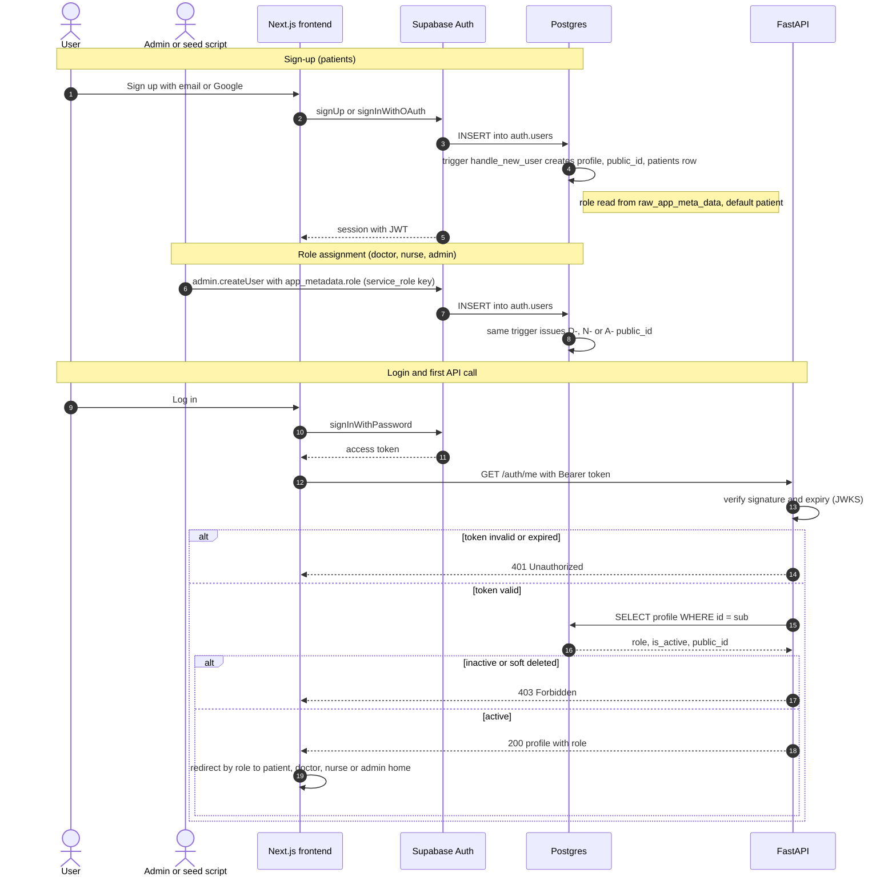
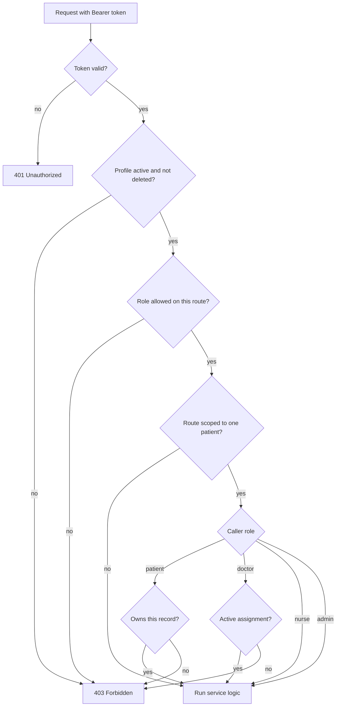
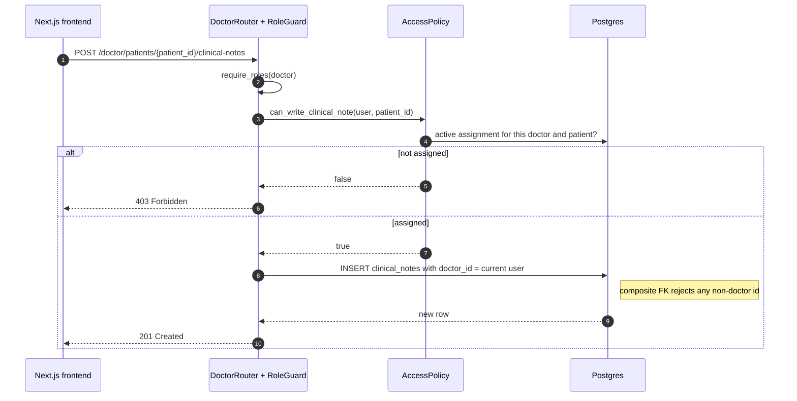

# MedFlow Backend UML (FastAPI + SQLAlchemy + Supabase)

Based on `schema.sql` v3. Supabase Auth handles passwords and tokens. FastAPI verifies the JWT, loads the role from `profiles`, and enforces access.

## 0. Feature to module map

| Backend module | Feature | Router | Service | Tables touched |
|---|---|---|---|---|
| Auth flow | Sign-up, login, role assignment | `AuthRouter` | `AuthService` | `auth.users`, `profiles` |
| Patient profile | Create (complete) and view | `PatientRouter` | `PatientService` | `patients`, `profiles` |
| Doctor | Patient list + clinical notes | `DoctorRouter` | `ClinicalNoteService` | `doctor_patient_assignments`, `clinical_notes` |
| Nurse | Care notes + status updates | `NurseRouter` | `CareNoteService` | `care_notes`, `patients.status` |
| Dashboards | One home screen per role | `DashboardRouter` | `DashboardService` | read-only over all tables |
| Access control testing | Each role sees only its scope | none | none | `AccessControlTestSuite` (pytest) |

## 1. Class diagram (layers)

```mermaid
classDiagram
    direction TB

    %% ---------------- Security ----------------
    class JWTVerifier {
        <<security>>
        +verify(token) Claims
    }
    class CurrentUser {
        +UUID id
        +UserRole role
        +str public_id
    }
    class RoleGuard {
        <<dependency>>
        +get_current_user(token) CurrentUser
        +require_roles(roles) CurrentUser
    }
    class AccessPolicy {
        <<service>>
        +can_view_patient(user, patient_id) bool
        +can_write_clinical_note(user, patient_id) bool
        +can_write_care_note(user, patient_id) bool
        +can_update_status(user, patient_id) bool
    }

    %% ---------------- Routers ----------------
    class AuthRouter {
        <<router>>
        +get_me() ProfileOut
    }
    class PatientRouter {
        <<router>>
        +get_my_record() PatientOut
        +update_my_profile(body) PatientOut
        +get_my_notes() NotesOut
        +get_patient(patient_id) PatientOut
        +get_patient_notes(patient_id) NotesOut
    }
    class DoctorRouter {
        <<router>>
        +list_my_patients() PatientList
        +create_clinical_note(patient_id, body) NoteOut
        +update_clinical_note(note_id, body) NoteOut
        +delete_clinical_note(note_id) None
    }
    class NurseRouter {
        <<router>>
        +list_patients() PatientList
        +create_care_note(patient_id, body) NoteOut
        +update_care_note(note_id, body) NoteOut
        +update_status(patient_id, body) PatientOut
    }
    class DashboardRouter {
        <<router>>
        +get_dashboard() DashboardOut
    }

    %% ---------------- Services ----------------
    class AuthService {
        <<service>>
        +load_profile(user_id) Profile
    }
    class PatientService {
        <<service>>
        +get_own_record(user) Patient
        +complete_profile(user, data) Patient
        +get_record(user, patient_id) Patient
        +list_visible_notes(user, patient_id) Notes
    }
    class ClinicalNoteService {
        <<service>>
        +list_assigned_patients(doctor_id) Patients
        +add_note(user, patient_id, data) ClinicalNote
        +edit_note(user, note_id, data) ClinicalNote
        +soft_delete_note(user, note_id) None
    }
    class CareNoteService {
        <<service>>
        +list_patients() Patients
        +add_note(user, patient_id, data) CareNote
        +edit_note(user, note_id, data) CareNote
        +set_status(user, patient_id, status) Patient
    }
    class DashboardService {
        <<service>>
        +build(user) DashboardOut
    }

    %% ---------------- Dashboard DTOs ----------------
    class DashboardOut {
        <<abstract>>
        +UserRole role
    }
    class PatientDashboard {
        +PatientOut record
        +NotesOut visible_notes
    }
    class DoctorDashboard {
        +PatientList assigned_patients
        +NotesOut recent_notes
    }
    class NurseDashboard {
        +PatientList patients_needing_care
    }
    class AdminDashboard {
        +int user_count
        +int patient_count
        +dict users_by_role
    }

    %% ---------------- ORM models (mirror schema.sql) ----------------
    class Profile {
        +UUID id
        +str full_name
        +str email
        +UserRole role
        +str public_id
        +bool is_active
        +datetime deleted_at
    }
    class Patient {
        +UUID id
        +UUID user_id
        +date date_of_birth
        +str blood_type
        +str allergies
        +PatientStatus status
        +datetime deleted_at
    }
    class DoctorPatientAssignment {
        +UUID id
        +UUID doctor_id
        +UUID patient_id
        +datetime assigned_at
        +datetime unassigned_at
    }
    class ClinicalNote {
        +UUID id
        +UUID patient_id
        +UUID doctor_id
        +str diagnosis
        +str observation
        +str plan
        +bool visible_to_patient
        +datetime deleted_at
    }
    class CareNote {
        +UUID id
        +UUID patient_id
        +UUID nurse_id
        +dict vitals
        +str observation
        +datetime deleted_at
    }
    class UserRole {
        <<enumeration>>
        patient
        doctor
        nurse
        admin
    }
    class PatientStatus {
        <<enumeration>>
        stable
        monitoring
        critical
    }

    %% ---------------- Testing ----------------
    class SeededUsers {
        <<fixture>>
        +admin
        +doctor_assigned
        +doctor_unassigned
        +nurse
        +patient_own
        +patient_other
    }
    class AccessControlTestSuite {
        <<pytest>>
        +test_anonymous_gets_401()
        +test_patient_reads_only_own_record()
        +test_unassigned_doctor_gets_403()
        +test_nurse_cannot_write_clinical_note()
        +test_doctor_cannot_write_care_note()
        +test_deactivated_user_gets_403()
        +test_forged_metadata_role_is_ignored()
        +test_each_role_gets_its_own_dashboard()
    }

    %% ---------------- Relationships ----------------
    AuthRouter ..> RoleGuard : Depends
    PatientRouter ..> RoleGuard : Depends
    DoctorRouter ..> RoleGuard : Depends
    NurseRouter ..> RoleGuard : Depends
    DashboardRouter ..> RoleGuard : Depends
    RoleGuard ..> JWTVerifier : verifies token
    RoleGuard ..> CurrentUser : builds
    RoleGuard ..> Profile : loads role

    AuthRouter --> AuthService
    PatientRouter --> PatientService
    DoctorRouter --> ClinicalNoteService
    NurseRouter --> CareNoteService
    DashboardRouter --> DashboardService

    PatientService ..> AccessPolicy
    ClinicalNoteService ..> AccessPolicy
    CareNoteService ..> AccessPolicy
    AccessPolicy ..> Patient : checks ownership
    AccessPolicy ..> DoctorPatientAssignment : checks assignment

    AuthService ..> Profile
    PatientService ..> Patient
    ClinicalNoteService ..> ClinicalNote
    CareNoteService ..> CareNote
    CareNoteService ..> Patient : updates status
    DashboardService ..> DashboardOut : returns

    DashboardOut <|-- PatientDashboard
    DashboardOut <|-- DoctorDashboard
    DashboardOut <|-- NurseDashboard
    DashboardOut <|-- AdminDashboard

    Profile "1" --> "0..1" Patient : patient account
    Patient "1" --> "*" DoctorPatientAssignment
    Patient "1" --> "*" ClinicalNote
    Patient "1" --> "*" CareNote
    Profile "1" --> "*" ClinicalNote : doctor writes
    Profile "1" --> "*" CareNote : nurse writes
    Profile ..> UserRole
    Patient ..> PatientStatus

    AccessControlTestSuite ..> SeededUsers : uses
    AccessControlTestSuite ..> RoleGuard : exercises via API
```



## 2. Sequence: auth flow (sign-up, login, role assignment)



## 3. Flowchart: authorization decision (every request)



## 4. Sequence: doctor writes a clinical note



FastAPI connects straight to Postgres and bypasses RLS, so `RoleGuard` and `AccessPolicy` are the real gate. RLS and the composite foreign keys are the safety net behind them.

## 5. Endpoints and role access

| Method and path | Patient | Doctor | Nurse | Admin |
|---|---|---|---|---|
| `GET /auth/me` | ✅ | ✅ | ✅ | ✅ |
| `GET /dashboard` | own payload | own payload | own payload | own payload |
| `GET /patients/me` | ✅ | 403 | 403 | 403 |
| `PATCH /patients/me` (DOB, blood type, allergies) | ✅ | 403 | 403 | 403 |
| `GET /patients/me/notes` | ✅ visible notes only | 403 | 403 | 403 |
| `GET /patients/{id}` and `/notes` | own only | assigned only | all | all |
| `GET /doctor/patients` | 403 | ✅ assigned only | 403 | 403 |
| `POST /doctor/patients/{id}/clinical-notes` | 403 | assigned only | 403 | 403 |
| `PATCH` or `DELETE /doctor/clinical-notes/{id}` | 403 | own notes only | 403 | 403 |
| `GET /nurse/patients` | 403 | 403 | ✅ | 403 |
| `POST /nurse/patients/{id}/care-notes` | 403 | 403 | ✅ | 403 |
| `PATCH /nurse/patients/{id}/status` | 403 | 403 | ✅ | 403 |

Dashboard payloads: patient gets own record and visible notes, doctor gets assigned patients and recent notes, nurse gets patients ordered by status (critical first), admin gets user and patient counts.

## 6. Access control test plan

| Test | Expected |
|---|---|
| No token or expired token on any route | 401 |
| Deactivated user (`is_active = false`) | 403 |
| Patient reads another patient's record | 403 |
| Doctor not assigned to the patient reads or writes | 403 |
| Nurse posts a clinical note | 403 |
| Doctor posts a care note or changes status | 403 |
| Patient sets own `status` or `role` in a PATCH body | ignored or 422 |
| `role` forged in `user_metadata` at sign-up | account is still a patient |
| Unassigned doctor after reassignment (`unassigned_at` set) | loses access |
| Soft-deleted note | not returned to anyone |
| `GET /dashboard` per role | payload shape matches the role |
| Patient sees a clinical note with `visible_to_patient = false` | not returned |

## 7. Suggested folder structure

```
backend/src/
├── main.py
├── core/
│   ├── config.py          # Settings
│   ├── security.py        # JWTVerifier
│   └── deps.py            # RoleGuard, get_db
├── models/                # Profile, Patient, ... (SQLAlchemy)
├── schemas/               # Pydantic request and response models, DashboardOut
├── services/
│   ├── access_policy.py
│   ├── auth_service.py
│   ├── patient_service.py
│   ├── clinical_note_service.py
│   ├── care_note_service.py
│   └── dashboard_service.py
├── routers/
│   ├── auth.py
│   ├── patient.py
│   ├── doctor.py
│   ├── nurse.py
│   └── dashboard.py
└── tests/
    ├── conftest.py        # SeededUsers
    └── test_access_control.py
```