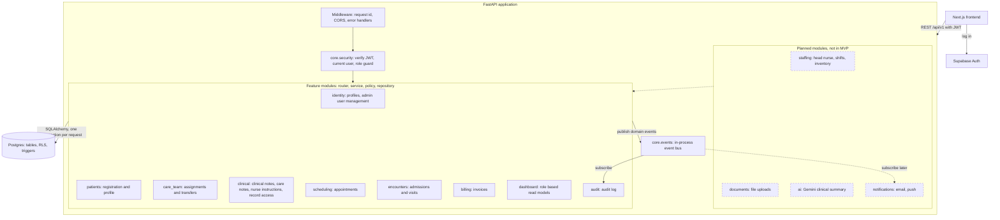
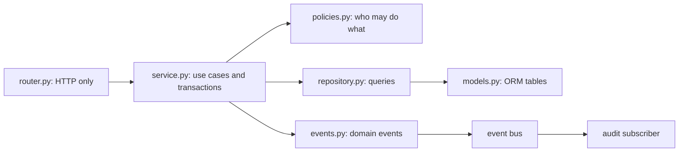
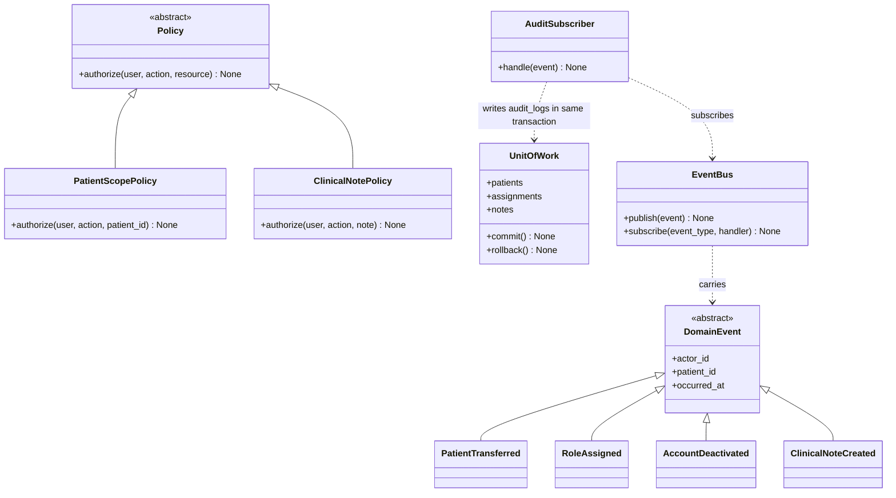
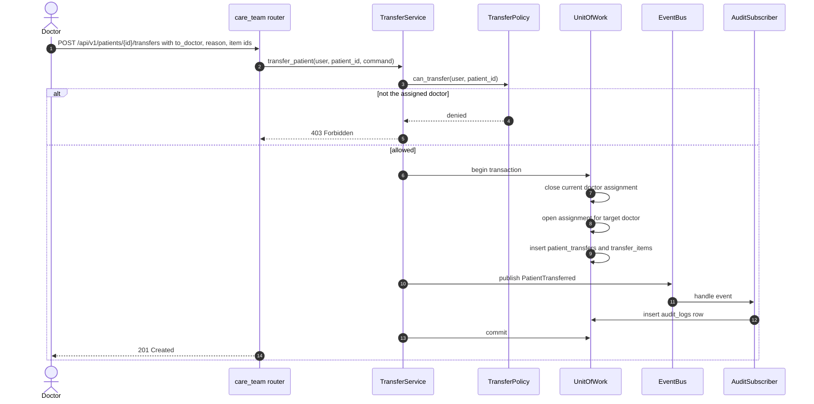

Here are a couple things I want you to take note 

Admin
-------
1. ONLY admin are allowed to assign roles like doctor ,head nurse and nurses
2. Admin can observe log audit betwen patient nurse and doctor 
3. admin can active or deactive user account 
4. admin can see how patient who are admitted , visit hospital 
5. Oversee the hospital daily operation

Nurse
-------
1. Nurse can create add , delete and update a care record ( but it is not visible to user )
2. other nurse who take care of the same patient can look up on the care record written y other nurses
3. can look ip on notes left by the doctor with this patient 

Doctor
------
1. doctor can schedule appointmnet and look up for thier upcming appointment
2. Doctor can transfer patient to another doctor , it will be updated in the audit log section 
3. Doctor can create patient profile 
4. create clinical notes across each patient profile. decide if they want to let the patient reciew the prifile 
5. transfer the patient to another doctoe , select whta are the docuemnt to transfer 
6. write note under the patrient profile to keep leave a note for the nurse on what hey need to keep note wiht this patent 

Patient
------
1. Patient has a medical record and care record , they cant see the record unless they are allowed to read the medical record by the doctor 
2. Patient can see their own bill record fromt heir portal , with break down of o
3. See thier upcoming appointment or next appointment with the doctor 
 
Head Nurse will put on hold until we have create a MVP first , here are the main task that need to be build for now , based on this , update constryc a new mermaid diagrma , ake sure the architecture is can be expanded when we scale the systema and expand the features. Suggest the best folder structure for this scenario. that applied the insdustry stadard of system architeture for a backend system 

# MedFlow MVP Architecture

Supersedes `erd.md` and `backend_uml.md`. Head nurse is **on hold** until the MVP works, but every extension point for it is already in the design.

**Style:** modular monolith. One FastAPI app, one deployable, but the code is split into feature modules with strict boundaries. Each module can later become its own service without a rewrite.

## 1. Requirements to modules

| Role | Requirement | Module | Data |
|---|---|---|---|
| Admin | Only admin assigns roles (doctor, nurse) | `identity` | `profiles`, `audit_logs` |
| Admin | Observe audit log between patient, nurse, doctor | `audit` | `audit_logs` |
| Admin | Activate or deactivate accounts | `identity` | `profiles.is_active` |
| Admin | See admitted and visiting patients | `encounters` | `encounters` |
| Admin | Oversee daily operation | `dashboard` | read models over all tables |
| Nurse | Create, update, delete care records (hidden from patient) | `clinical` | `care_notes` |
| Nurse | Read other nurses' care records on the same patient | `care_team` + `clinical` | `nurse_patient_assignments`, `care_notes` |
| Nurse | Read the doctor's notes for the patient | `clinical` | `nurse_instructions`, `clinical_notes` |
| Doctor | Schedule and view upcoming appointments | `scheduling` | `appointments` |
| Doctor | Transfer a patient, choosing the documents | `care_team` | `patient_transfers`, `transfer_items`, assignments |
| Doctor | Create a patient profile | `patients` | `patients` |
| Doctor | Clinical notes, and decide if the patient may review the record | `clinical` | `clinical_notes`, `record_access_grants` |
| Doctor | Leave notes for nurses | `clinical` | `nurse_instructions` |
| Patient | Medical and care record, only if the doctor allows | `clinical` | `record_access_grants` |
| Patient | Own bill with breakdown | `billing` | `invoices`, `invoice_items` |
| Patient | Upcoming appointments | `scheduling` | `appointments` |

## 2. Data model (ERD)

Phantom role columns (`doctor_role`, `nurse_role`, ...) that power the composite FK guards from `schema.sql` are omitted here for readability. They still apply to every `doctor_id`, `nurse_id`, `from_doctor_id` and `to_doctor_id`.

```mermaid
erDiagram

    AUTH_USERS {
        uuid id PK "Supabase managed"
        text email
        jsonb raw_app_meta_data "role set by service_role only"
    }

    PROFILES {
        uuid id PK, FK "references auth.users"
        text full_name
        text email UK
        user_role role "patient, doctor, nurse, admin. immutable"
        text public_id UK "D-0001, N-0001, A-0001. NULL for patient accounts"
        text phone
        boolean is_active "admin activate or deactivate"
        timestamptz created_at
        timestamptz deleted_at
    }

    PATIENTS {
        uuid id PK
        text public_id UK "P-0001 medical record number"
        uuid user_id FK, UK "NULL until the patient gets a portal login"
        text full_name
        date date_of_birth
        text phone
        text blood_type
        text allergies
        patient_status status "stable, monitoring, critical"
        uuid created_by FK "doctor who registered the patient"
        timestamptz created_at
        timestamptz updated_at
        timestamptz deleted_at
    }

    DOCTOR_PATIENT_ASSIGNMENTS {
        uuid id PK
        uuid doctor_id FK
        uuid patient_id FK
        uuid transfer_id FK "set when created by a transfer"
        timestamptz assigned_at
        timestamptz unassigned_at "NULL means active"
    }

    NURSE_PATIENT_ASSIGNMENTS {
        uuid id PK
        uuid nurse_id FK
        uuid patient_id FK
        uuid assigned_by FK
        timestamptz assigned_at
        timestamptz unassigned_at "NULL means active"
    }

    CLINICAL_NOTES {
        uuid id PK
        uuid patient_id FK
        uuid doctor_id FK
        text diagnosis
        text observation
        text plan
        timestamptz created_at
        timestamptz updated_at
        timestamptz deleted_at
    }

    NURSE_INSTRUCTIONS {
        uuid id PK
        uuid patient_id FK
        uuid doctor_id FK
        text body "what the nurse should keep in mind"
        instruction_priority priority "routine, important, urgent"
        timestamptz created_at
        timestamptz updated_at
        timestamptz deleted_at
    }

    CARE_NOTES {
        uuid id PK
        uuid patient_id FK
        uuid nurse_id FK
        jsonb vitals "bp, hr, temp"
        text observation
        timestamptz created_at
        timestamptz updated_at
        timestamptz deleted_at "nurse soft delete"
    }

    RECORD_ACCESS_GRANTS {
        uuid id PK
        uuid patient_id FK
        record_scope scope "medical_record now, care_record reserved"
        uuid granted_by FK "doctor"
        timestamptz granted_at
        timestamptz revoked_at "NULL means active"
        uuid revoked_by FK
    }

    APPOINTMENTS {
        uuid id PK
        uuid patient_id FK
        uuid doctor_id FK
        timestamptz starts_at
        timestamptz ends_at
        appointment_status status "scheduled, completed, cancelled, no_show"
        text reason
        uuid created_by FK
        timestamptz created_at
        timestamptz updated_at
    }

    ENCOUNTERS {
        uuid id PK
        uuid patient_id FK
        uuid attending_doctor_id FK
        uuid appointment_id FK "optional"
        encounter_type encounter_type "admission or visit"
        text reason
        text ward "inpatient only"
        timestamptz started_at
        timestamptz ended_at "NULL while still admitted"
        uuid created_by FK
    }

    PATIENT_TRANSFERS {
        uuid id PK
        uuid patient_id FK
        uuid from_doctor_id FK
        uuid to_doctor_id FK
        text reason
        transfer_status status "completed now, pending when approvals are added"
        uuid transferred_by FK
        timestamptz created_at
    }

    TRANSFER_ITEMS {
        uuid id PK
        uuid transfer_id FK
        transfer_item_type item_type "clinical_note, nurse_instruction"
        uuid item_id "the document handed over"
    }

    INVOICES {
        uuid id PK
        text invoice_number UK
        uuid patient_id FK
        uuid encounter_id FK "optional"
        invoice_status status "draft, issued, paid, void"
        text currency
        numeric total
        timestamptz issued_at
        timestamptz due_at
        timestamptz paid_at
        uuid created_by FK
    }

    INVOICE_ITEMS {
        uuid id PK
        uuid invoice_id FK
        invoice_category category "consultation, medication, procedure, room, lab, other"
        text description
        int quantity
        numeric unit_price
        numeric line_total
    }

    AUDIT_LOGS {
        uuid id PK
        uuid actor_id FK
        user_role actor_role
        text action "e.g. patient.transfer, role.assign"
        text entity_type
        uuid entity_id
        uuid patient_id FK "powers the per patient timeline"
        jsonb changes "field names and ids only, never clinical text"
        timestamptz created_at "append only"
    }

    AUTH_USERS ||--|| PROFILES : "has profile"
    PROFILES |o--o| PATIENTS : "portal login"
    PROFILES ||--o{ PATIENTS : "registers"

    PROFILES ||--o{ DOCTOR_PATIENT_ASSIGNMENTS : "doctor"
    PATIENTS ||--o{ DOCTOR_PATIENT_ASSIGNMENTS : "assigned to"
    PROFILES ||--o{ NURSE_PATIENT_ASSIGNMENTS : "nurse on care team"
    PATIENTS ||--o{ NURSE_PATIENT_ASSIGNMENTS : "cared for by"

    PROFILES ||--o{ CLINICAL_NOTES : "doctor writes"
    PATIENTS ||--o{ CLINICAL_NOTES : "has"
    PROFILES ||--o{ NURSE_INSTRUCTIONS : "doctor writes"
    PATIENTS ||--o{ NURSE_INSTRUCTIONS : "has"
    PROFILES ||--o{ CARE_NOTES : "nurse writes"
    PATIENTS ||--o{ CARE_NOTES : "has"
    PATIENTS ||--o{ RECORD_ACCESS_GRANTS : "access given"
    PROFILES ||--o{ RECORD_ACCESS_GRANTS : "doctor grants"

    PATIENTS ||--o{ APPOINTMENTS : "books"
    PROFILES ||--o{ APPOINTMENTS : "doctor schedules"
    PATIENTS ||--o{ ENCOUNTERS : "admitted or visits"
    PROFILES ||--o{ ENCOUNTERS : "attending doctor"
    APPOINTMENTS |o--o{ ENCOUNTERS : "becomes visit"

    PATIENTS ||--o{ PATIENT_TRANSFERS : "moved"
    PROFILES ||--o{ PATIENT_TRANSFERS : "from or to doctor"
    PATIENT_TRANSFERS ||--o{ TRANSFER_ITEMS : "documents"
    PATIENT_TRANSFERS |o--o{ DOCTOR_PATIENT_ASSIGNMENTS : "creates"

    PATIENTS ||--o{ INVOICES : "billed"
    ENCOUNTERS |o--o{ INVOICES : "billed for"
    INVOICES ||--|{ INVOICE_ITEMS : "breakdown"

    PROFILES |o--o{ AUDIT_LOGS : "actor"
    PATIENTS |o--o{ AUDIT_LOGS : "about"
```



### Enums

| Enum | Values |
|---|---|
| `user_role` | `patient`, `doctor`, `nurse`, `admin` (`head_nurse` added later by one `ALTER TYPE`) |
| `patient_status` | `stable`, `monitoring`, `critical` |
| `record_scope` | `medical_record`, `care_record` |
| `appointment_status` | `scheduled`, `completed`, `cancelled`, `no_show` |
| `encounter_type` | `admission`, `visit` |
| `transfer_status` | `pending`, `completed`, `cancelled` |
| `transfer_item_type` | `clinical_note`, `nurse_instruction` |
| `instruction_priority` | `routine`, `important`, `urgent` |
| `invoice_status` | `draft`, `issued`, `paid`, `void` |
| `invoice_category` | `consultation`, `medication`, `procedure`, `room`, `lab`, `other` |

## 3. System architecture (modular monolith)

Dashed boxes are planned modules. They plug in without touching the existing ones.



### Inside every module



Dependency rule: arrows only point right. A router never touches a repository, a repository never imports a service, and a module never imports another module's repository. Cross-module calls go through the other module's service, or through an event.

## 4. Core abstractions (the extension points)



## 5. Sequence: transfer a patient with selected documents



Why this shape: the audit row is written inside the same transaction as the change, so a transfer can never exist without its audit entry (or the reverse).

## 6. Access matrix (MVP)

| Resource | Patient | Doctor | Nurse | Admin |
|---|---|---|---|---|
| Patient demographics | own | patients they registered or are assigned | care team patients | all (admissions view) |
| Register patient | no | create | no | no |
| Clinical notes | own, only with active grant | write; read own notes and notes handed over by transfer | read on care team patients | no |
| Nurse instructions | no | write | read on care team patients | no |
| Care notes | never (MVP) | read on assigned patients | create, update, soft delete own; read all on care team patients | no |
| Record access grants | read own | grant or revoke for own patients | no | no |
| Appointments | own, read | create, read, update own | no | read all |
| Encounters (admitted, visits) | own, read | create for own patients | read on care team patients | read all |
| Invoices | own, read | no | no | create and manage |
| Transfers | no | transfer own patients | no | via audit log |
| Audit logs | no | no | no | read only |
| Accounts and roles | no | no | no | create staff, assign role, activate or deactivate |

Admin deliberately cannot read clinical or care notes. Admin sees who is admitted, what happened (audit), and operational counts, which is the minimum needed to run the hospital.

## 7. Dashboards

| Role | Payload |
|---|---|
| Patient | upcoming appointments, outstanding invoices, record (only if granted) |
| Doctor | assigned patients, today's and upcoming appointments, recent notes |
| Nurse | care team patients ordered by status (critical first), new nurse instructions |
| Admin | admitted now, visits today, appointments today, active users by role, critical patient count, latest audit events |

## 8. Folder structure

Package by feature, layered inside each feature (the layout used by most production FastAPI codebases). The database lives outside `backend/` because it holds RLS, triggers and enums that an ORM cannot generate.

```
medflow/
├── backend/
│   ├── pyproject.toml
│   ├── Dockerfile
│   ├── .env.example
│   ├── app/
│   │   ├── main.py                     # create_app(), mounts /api/v1, registers subscribers
│   │   ├── api/
│   │   │   └── v1/
│   │   │       └── router.py           # includes every module router
│   │   ├── core/
│   │   │   ├── config.py               # pydantic-settings
│   │   │   ├── security.py             # JWT and JWKS verification
│   │   │   ├── dependencies.py         # get_current_user, require_roles, get_uow
│   │   │   ├── permissions.py          # Role enum, base Policy
│   │   │   ├── events.py               # EventBus, DomainEvent
│   │   │   ├── errors.py               # domain exceptions and handlers
│   │   │   └── logging.py
│   │   ├── db/
│   │   │   ├── base.py                 # DeclarativeBase, timestamp and soft delete mixins
│   │   │   ├── session.py              # engine, session factory
│   │   │   └── unit_of_work.py
│   │   ├── modules/
│   │   │   ├── identity/               # profiles, admin user management
│   │   │   ├── patients/               # registration, profile
│   │   │   ├── care_team/              # assignments, transfers
│   │   │   ├── clinical/               # clinical notes, care notes, nurse instructions, record access
│   │   │   │   ├── router.py
│   │   │   │   ├── schemas.py          # Pydantic request and response models
│   │   │   │   ├── service.py          # use cases
│   │   │   │   ├── policies.py         # authorization rules
│   │   │   │   ├── repository.py       # queries
│   │   │   │   ├── models.py           # SQLAlchemy tables
│   │   │   │   ├── events.py           # ClinicalNoteCreated, ...
│   │   │   │   └── exceptions.py
│   │   │   ├── scheduling/             # appointments
│   │   │   ├── encounters/             # admissions and visits
│   │   │   ├── billing/                # invoices
│   │   │   ├── audit/                  # models, repository, subscriber.py, router (admin only)
│   │   │   └── dashboard/              # read models per role, no tables of its own
│   │   └── shared/
│   │       ├── schemas.py              # pagination, error shape
│   │       └── utils.py
│   ├── tests/
│   │   ├── conftest.py                 # seeded users, test client
│   │   ├── factories/
│   │   ├── unit/                       # services and policies
│   │   ├── integration/                # repositories against a test database
│   │   └── access_control/             # role by endpoint matrix
│   └── scripts/
│       └── seed.py                     # service_role seed for staff accounts
├── database/                           # source of truth for the schema
│   ├── migrations/                     # 001_init.sql, 002_..., numbered and ordered
│   ├── policies/                       # rls.sql
│   └── seeds/
├── frontend/                           # Next.js
├── docs/
│   └── architecture.md                 # this file
└── .github/workflows/ci.yml            # lint, tests, access control suite
```

### Why this structure

| Choice | Reason |
|---|---|
| Package by feature, not by type | Everything for "clinical" lives together, so a feature is added or removed in one folder |
| Router, service, repository split | Routers stay thin, business rules are testable without HTTP, SQL is isolated |
| `policies.py` per module | Authorization rules are in one auditable place instead of scattered `if role ==` checks |
| Unit of work | One transaction per use case, which is what makes the audit guarantee in section 5 possible |
| Event bus for side effects | Audit now, notifications and AI summaries later, with no edits to the module that raised the event |
| `/api/v1` prefix | A breaking change becomes `/api/v2` without breaking the frontend |
| `database/` as source of truth | RLS, triggers, enums and composite FKs are SQL. Alembic autogenerate cannot produce them. |
| `tests/access_control/` | The "each role only sees what it should" suite is a first-class folder and runs in CI |

## 9. How the design expands

| Future change | What you touch |
|---|---|
| Head nurse | One migration (`ALTER TYPE user_role ADD VALUE 'head_nurse'`), a new `modules/staffing/` (shifts, inventory, supervision), new policy classes. Existing modules stay unchanged. |
| AI clinical summary | New `modules/ai/`, reads through `clinical` service interfaces |
| File uploads (lab results, scans) | New `modules/documents/`, add `document` to `transfer_item_type` |
| Notifications | A subscriber on the existing event bus |
| Payments | Extend `billing` with a `payments` table |
| Scale out | Split one module into its own service. Its service interface and events already define the boundary. |
| Slow reads | Add caching or read replicas behind `dashboard` only |

## 10. Assumptions to confirm

These are gaps or contradictions in the requirements. The diagrams use the defaults shown.

| # | Topic | Default used |
|---|---|---|
| 1 | Nurse says care records are never visible to the patient, patient says records are visible when the doctor allows | Care notes are never patient visible in the MVP. The grant has a `care_record` scope reserved for later. |
| 2 | Who assigns nurses to patients (head nurse is on hold) | Admin or the patient's doctor |
| 3 | Transfer "select documents" | The new doctor sees only the selected clinical notes and nurse instructions. The previous doctor keeps their own. |
| 4 | Nurse scope | Nurses only see patients on their care team |
| 5 | Who creates invoices (no billing role) | Admin. The requirement was cut off at "breakdown of o...", so categories are my guess. |
| 6 | Who admits a patient or logs a visit | The attending doctor, or admin |
| 7 | Admin access to clinical content | None. Admin gets admissions, audit and counts only. |
| 8 | Patient IDs | `P-` IDs move to `patients`, so a patient without a login still has one |