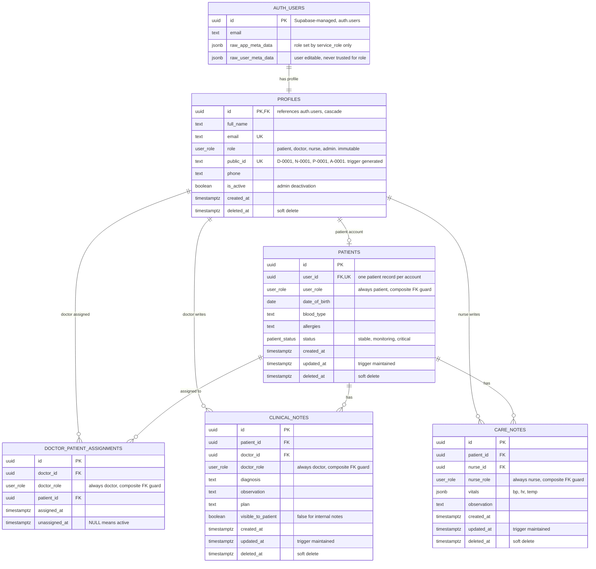

# MedFlow ERD (matches `schema.sql` v3)

## Enums

| Enum | Values |
|------|--------|
| `user_role` | `patient`, `doctor`, `nurse`, `admin` |
| `patient_status` | `stable`, `monitoring`, `critical` |

## Guardrails that the diagram cannot show

| Guardrail | Where | What it prevents |
|-----------|-------|------------------|
| `UNIQUE (id, role)` on `profiles` + composite FKs | `patients`, `doctor_patient_assignments`, `clinical_notes`, `care_notes` | A doctor FK pointing at a nurse or patient (and the reverse) |
| `public_id_matches_role` CHECK + `trg_public_id` | `profiles` | A `D-` ID on a non-doctor |
| `trg_block_role_change` | `profiles` | Changing a role after creation, so `public_id` stays truthful |
| Partial unique index `uq_active_assignment` | assignments | The same doctor assigned twice to one patient, while keeping history |
| `ON DELETE RESTRICT` | assignments, notes | Deleting an account that wipes medical records. Use `deleted_at`. |
| `ON DELETE CASCADE` | `auth.users` to `profiles` to `patients` | Orphaned profiles when a test user is removed |
| `trg_*_updated` | patients, clinical_notes, care_notes | Stale `updated_at` |
| `on_auth_user_created` | `auth.users` | Signup without a profile. Role comes from `raw_app_meta_data`, default `patient`, and patients also get a `patients` row. |

## Access summary (RLS)

| Table | Patient | Doctor | Nurse | Admin |
|-------|---------|--------|-------|-------|
| `profiles` | own row | read all | read all | read and update |
| `patients` | own row | assigned only, can update | all, can update status | all, can insert |
| `doctor_patient_assignments` | none | own rows | read | full |
| `clinical_notes` | own, if `visible_to_patient` | assigned patients, insert and update own | read | read |
| `care_notes` | own | assigned patients, read | insert and update own | read |

The FastAPI backend connects directly to Postgres and bypasses RLS, so repeat these role checks in the API.